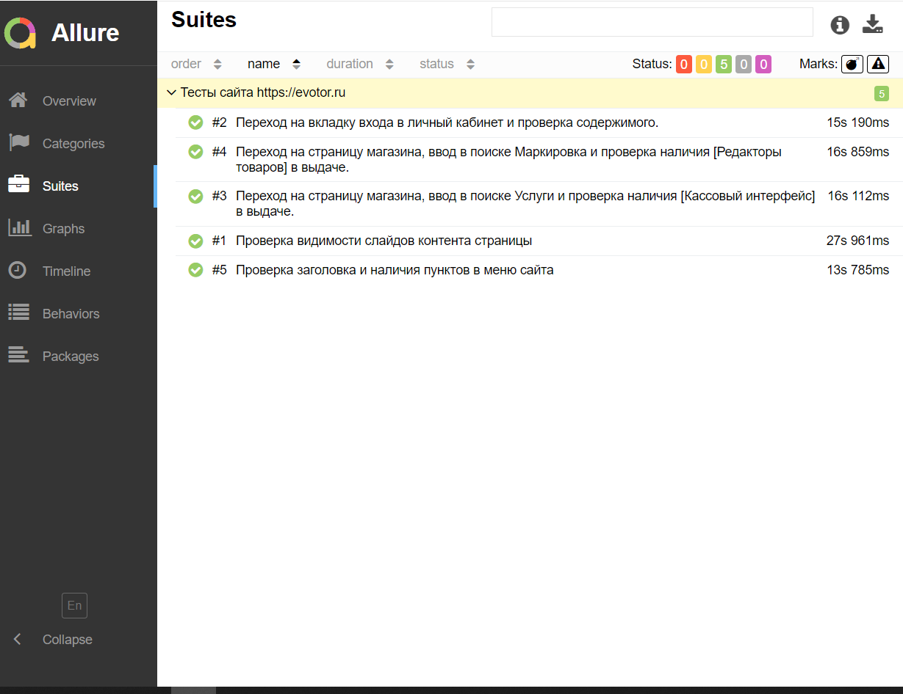
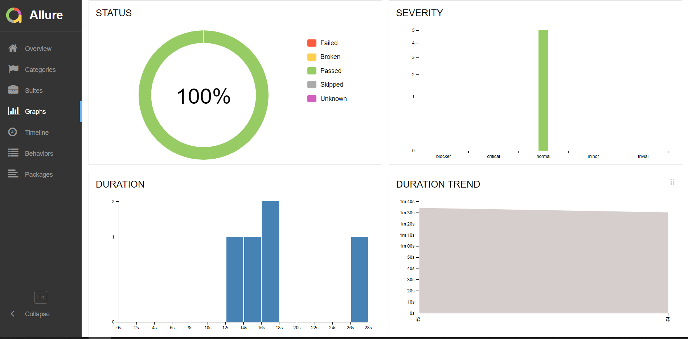
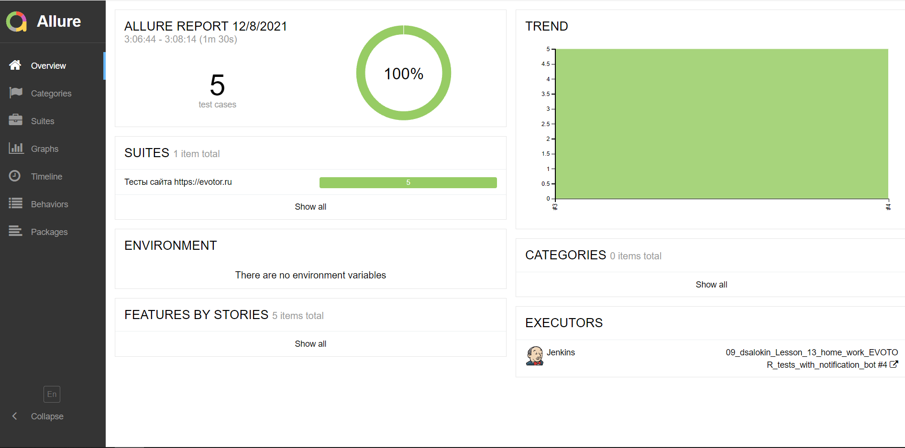
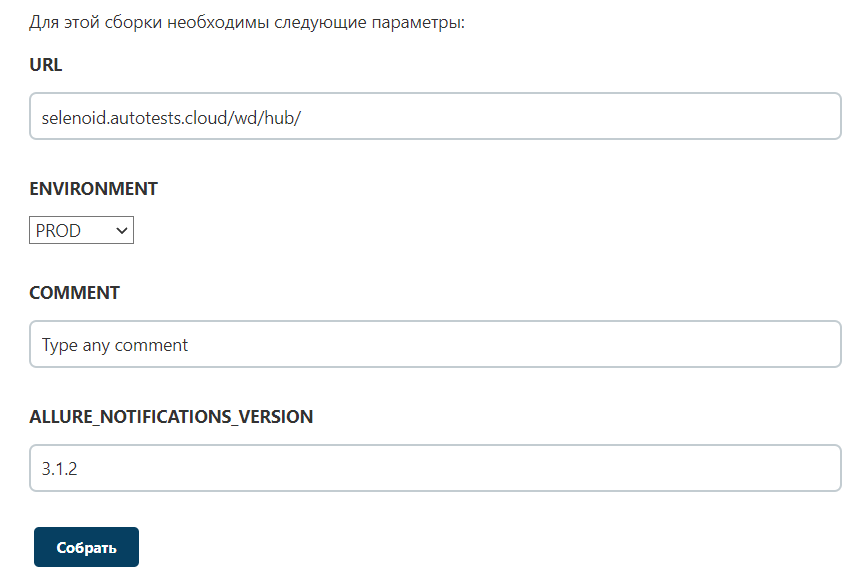
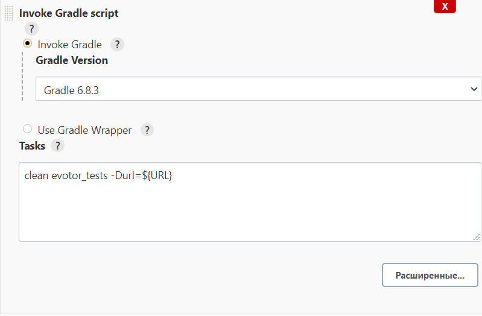
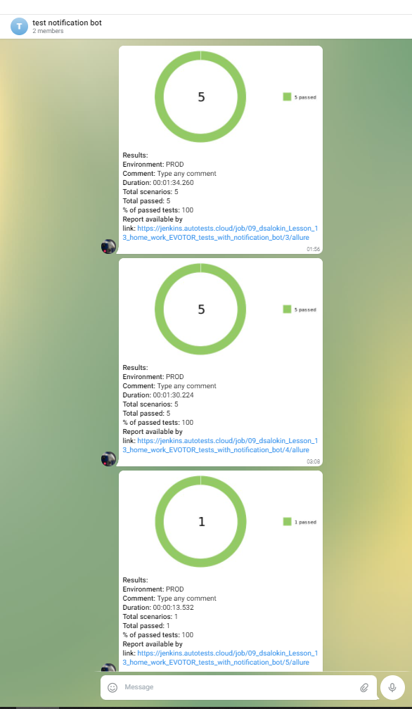
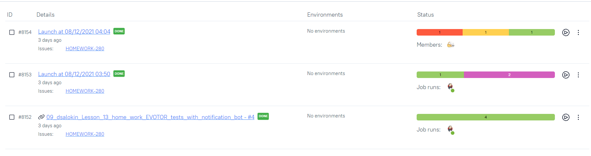
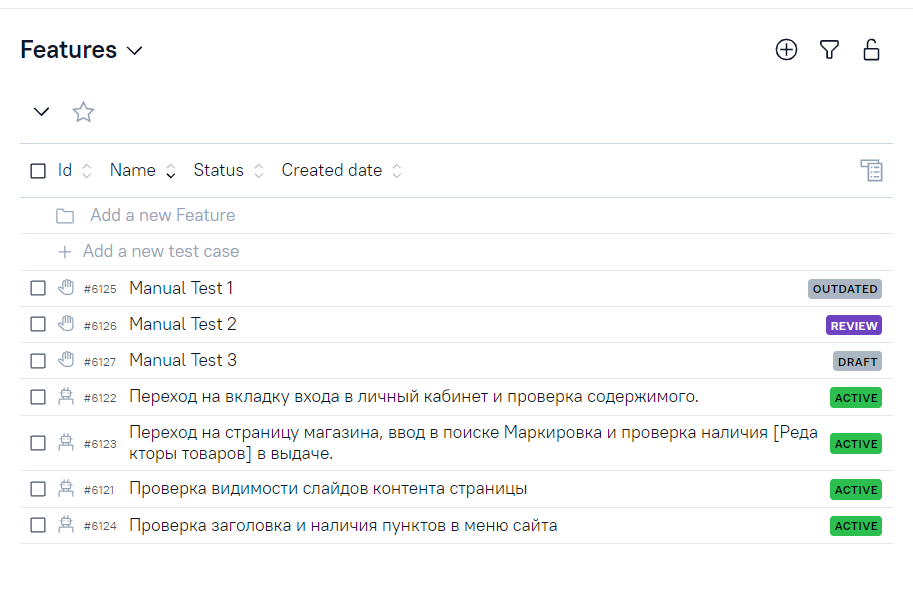
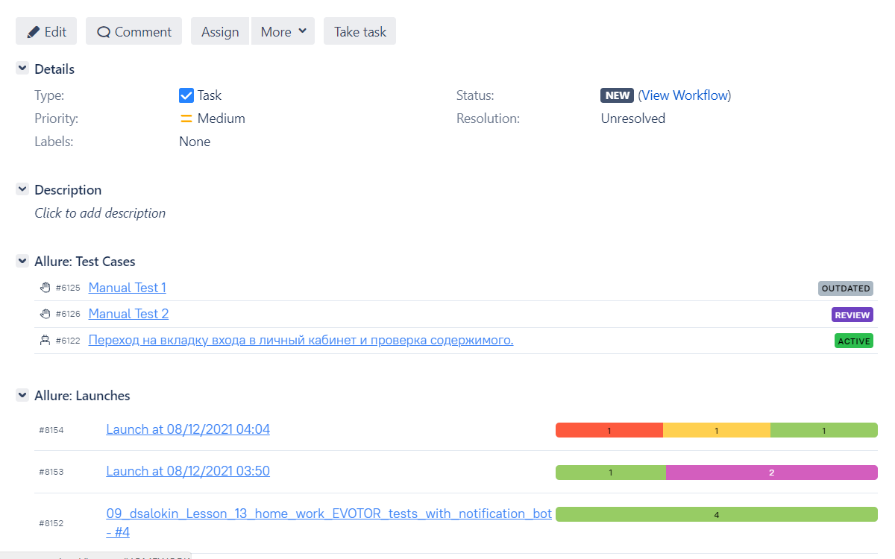

# Lesson-13-Force-start-QA-HomeWork
Домашнее задание к 13 уроку, разработка простого проекта под вакансию
_____________________________________________________________________
# Project base URL: https://evotor.ru/

## Gradle tasks:

#### clean evotor_tests -Durl=${URL}
#### clean login_page_tests -Durl=${URL}
#### clean market_page_tests -Durl=${URL}
#### clean blocker_tests -Durl=${URL}
#### clean critical_tests -Durl=${URL}
#### clean major_tests -Durl=${URL}
#### clean minor_tests -Durl=${URL}

## Technology stack:

### Infrastructure:

### Test & Release management:

## UI tests:

- [X] :zero: Main Page tests
- [X] :one: Login test
- [X] :two: Market parameterized test

## Screenshots:

#### *Allure Report - it is a flexible lightweight test report tool:*

## *Selenoid - it is a powerful Golang implementation of original Selenium hub code:*

#### *Jenkins - it is an opensource automation server:*

## *Telegram notifications:*

## *Allure TestOps - it is a Software Quality Management Platform for automated and manual testing:*

## *Jira - it is part of a family of products designed to help teams of all types manage work:*

### Contacts:

